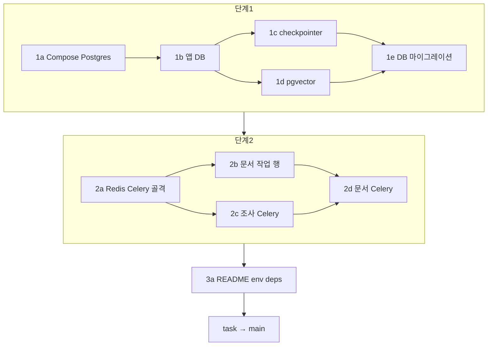

# 스케일 아웃 가능 구조로 전환

- 작성일: 2026-08-07
- 상태: 계획
- 근거: [수평 확장 병목 탐색](../reports/2026-08-07-scale-out-bottlenecks.md)
- 목표: 웹 서버를 여러 대 띄워도 상태·긴 일이 한 프로세스에 묶이지 않는 구조로 바꾼다.

## 한 줄 요약

공유 DB·벡터·대화 이어가기 저장을 Postgres/pgVector로 모으고, **기존 SQLite/Chroma 데이터 마이그레이션**을 포함하며, 조사·문서 생성 같은 긴 일은 웹과 별도 워커 프로세스(Celery + Redis)로 옮긴다. 원고 파일 저장소는 이번 범위 밖이다.

리뷰는 **큰 묶음 브랜치가 아니라 작업 단위 PR**로 한다. 브랜치가 깊어져도 된다.

## 범위

### 한다

| 영역 | 현재 | 목표 |
|------|------|------|
| 앱 DB | SQLite 파일 | PostgreSQL |
| 대화·그래프 이어가기 저장 | SQLite 파일 (`AsyncSqliteSaver`) | PostgreSQL용 checkpointer |
| 벡터 검색 | 로컬 Chroma | PostgreSQL pgvector |
| DB 마이그레이션 | 없음 (빈 DB `create_all`만) | 기존 SQLite·Chroma 데이터를 Postgres/pgvector로 옮기는 **재현 가능 절차·스크립트** |
| 긴 일 실행 | 웹 프로세스 안 `asyncio.create_task` | 웹은 등록만, 워커가 실행 (Celery + Redis) |
| 문서 생성 | ACK만 보내고 Task에 던짐 | 조사처럼 DB에 남는 작업 행 + 워커 실행 |
| Compose | 앱 1개 + `/data` 볼륨 | Postgres, Redis, web, worker |
| 문서·의존성 | SQLite/Chroma 전제 | 로컬 기동·환경변수·실행 방법·마이그레이션 실행법 갱신 |

### 하지 않는다 (다음 단계)

- 원고·조사 원문 파일의 공유 객체 저장소 전환 (`LocalFileStorage` 유지)
- 로드밸런서와 web 복제본을 프로덕션처럼 고정하는 작업 (구조만 가능하게 만듦)
- Kafka 등 무거운 메시지 브로커

파일 저장을 안 바꾸면 **같은 디스크/볼륨을 공유하지 않는 복수 머신**에서는 원고·원문이 깨질 수 있다. 이번 목표는 “한 호스트·공유 볼륨 또는 단일 스토리지 전제에서도 웹/워커 프로세스 분리와 DB 공유가 되는 것”까지다.

## 목표 구조

```text
Client
  → web (FastAPI, N 가능)
      → PostgreSQL     앱 메타, 조사/문서 작업 상태, 대화 이어가기, pgvector
      → Redis          Celery 쪽지함
      → (같은 볼륨)    파일 저장 — 이번엔 유지

  → worker (Celery, M 가능)
      → 같은 PostgreSQL / Redis / 파일 볼륨
      → 조사 실행, 문서 생성 실행
```

웹은 요청·SSE·작업 등록만 한다. 긴 LLM/조사 루프는 워커가 한다.

## 브랜치·PR 규칙

### 계층

```text
main
  └─ task/scale-out-architecture              ← Task 통합 (마지막에 main으로 PR)
        ├─ task/scale-out-1-shared-db         ← 단계 1 통합
        │     ├─ .../1a-compose-postgres      ← PR 1a → 1-shared-db
        │     ├─ .../1b-app-db                ← PR 1b → 1-shared-db
        │     ├─ .../1c-checkpointer          ← PR 1c → 1-shared-db
        │     ├─ .../1d-pgvector              ← PR 1d → 1-shared-db
        │     └─ .../1e-db-migration          ← PR 1e → 1-shared-db (데이터·스키마 이전)
        │           (1-shared-db → task 로 한 번 더 PR 가능)
        ├─ task/scale-out-2-workers           ← 단계 2 통합 (단계 1이 task에 들어간 뒤)
        │     ├─ .../2a-redis-celery-skeleton ← PR 2a → 2-workers
        │     ├─ .../2b-document-job          ← PR 2b → 2-workers
        │     ├─ .../2c-research-celery       ← PR 2c → 2-workers
        │     └─ .../2d-document-celery       ← PR 2d → 2-workers
        └─ task/scale-out-3-docs-deps         ← 단계 3 (1·2 반영 후)
              └─ .../3a-readme-env-deps       ← PR 3a → 3-docs-deps
```

- **게재·리뷰 단위 = 잎 브랜치 PR** (1a, 1b, 1c …). 단계 통합 브랜치·Task는 “모으는 곳”이다.
- 잎 PR의 base는 자기 단계 통합 브랜치 (`1-shared-db` / `2-workers` / `3-docs-deps`).
- 단계 통합 브랜치 → Task, Task → `main` 도 PR로 연다. 다만 **코드 리뷰의 본게임은 잎 PR**이다.
- 의존성·설정 추가는 **그 기능을 넣는 잎 PR에 같이** 넣는다. 작업 3은 최종 정리·README·빈틈 점검이다.

### 머지 순서 (잎 PR)

```text
1a → 1b → 1c → 1d → 1e
              ↘
               단계1 → task   ※ 1e(마이그레이션) 없이 단계1 완료로 보지 않음
                        ↓
2a → 2b → 2c → 2d → 단계2 → task
                              ↓
                         3a → 단계3 → task → main
```

`1c`(checkpointer)와 `1d`(pgvector)는 둘 다 `1b`(앱 DB) 이후다. **서로 파일 충돌이 적으면 병행 개발 가능**, 머지는 `1c` 다음 `1d`(또는 그 반대)로 직렬화한다.  
`1e`는 **1b·1c·1d가 단계1 브랜치에 반영된 뒤**에만 연다.

`2b`(문서 작업 행)는 Celery 없이도 가능하므로 `2a` 직후. `2c`·`2d`는 `2a`+해당 실행 경로 준비 후.

### 멀티 에이전트

| 에이전트 | 담당 잎 PR | 시작 조건 |
|----------|------------|-----------|
| A1 | 1a Compose Postgres | Task·단계1 브랜치·이 계획 |
| A2 | 1b 앱 DB | **1a 머지** |
| A3 | 1c checkpointer | **1b 머지** |
| A4 | 1d pgvector | **1b 머지** (1c와 병행 개발 가능) |
| A5 | 1e DB 마이그레이션 | **1b·1c·1d가 단계1에 반영** |
| B1 | 2a Redis·Celery 골격 | **단계1이 task에 머지** |
| B2 | 2b 문서 작업 행 | **2a 머지** (또는 2a와 순차) |
| B3 | 2c 조사 → Celery | **2a 머지**, 조사 실행 함수 유지 |
| B4 | 2d 문서 → Celery·Task 제거 | **2b·2c 머지** |
| C1 | 3a README·env·의존성 정리 | **단계2가 task에 머지** (초안 병행 후 재동기화 가능) |

규칙:

- 에이전트는 **자기 잎 브랜치에서만** 커밋한다.
- PR 본문에 아래 해당 절의 완료 조건을 체크리스트로 붙인다.
- 리뷰어는 잎 PR만 따라가면 전체 진행을 볼 수 있다.

### 데이터·스키마 마이그레이션 (필수)

코드만 Postgres를 가리키게 바꾸는 것으로 단계1을 끝내지 않는다. **기존 볼륨/로컬에 있던 데이터를 옮기는 절차**가 잎 PR `1e`로 반드시 들어간다.

| 대상 | 소스 | 목표 | 비고 |
|------|------|------|------|
| 앱 ORM 테이블 | `rag_history.db`(SQLite) | Postgres | 사용자·원고·채팅·조사 job/출처 메타 등 |
| 근거 벡터 | Chroma 디렉터리 | pgvector 테이블 | 덤프 이전이 어려우면 **저장된 원문 기준 재인덱싱** 절차로 대체 가능. 어느 쪽이든 문서화·검증 필수 |
| 대화 이어가기 | `draftsmith_checkpoint.db` | Postgres checkpointer | 포맷 호환이 안 되면 **빈 checkpointer로 재시작**을 명시하되, 앱 메타·채팅 화면 이력과의 관계를 README/스크립트에 적는다 |
| 스키마 | — | Postgres 테이블·확장 | 런타임 `ALTER` 금지. ORM `create_all` + checkpointer `setup` + 근거 테이블 생성을 **한 번에 재현하는 스크립트/문서**로 고정 |

---

## 단계 1 — 공유 DB·벡터

통합 브랜치: `task/scale-out-1-shared-db`

### PR 1a — Compose에 Postgres

브랜치: `task/scale-out-1a-compose-postgres` → base `task/scale-out-1-shared-db`

**할 일**

- PostgreSQL 서비스 추가 (pgvector 확장 사용 가능한 이미지)
- 앱 서비스에 DB URL 환경변수 연결 (아직 앱 코드가 SQLite여도 Compose 쪽만 완성 가능)
- 헬스체크·볼륨·네트워크

**완료 조건**

- [ ] `docker compose up`으로 Postgres가 healthy
- [ ] 컨테이너에서 pgvector 확장을 켤 수 있다
- [ ] 앱 컨테이너가 `DATABASE_URL`을 받는다 (코드 전환은 1b)

**PR 제목:** `chore: Compose에 Postgres(pgvector) 추가`

---

### PR 1b — 앱 DB를 Postgres로

브랜치: `task/scale-out-1b-app-db` → base `task/scale-out-1-shared-db`  
선행: **1a**

**할 일**

- SQLAlchemy 연결 SQLite → Postgres
- `DATABASE_URL` 등 설정, 엔진/세션 옵션
- 스키마는 ORM + `create_all`(또는 별도 마이그레이션). **런타임 `ALTER` 금지**
- 드라이버 의존성 추가
- 이 PR만으로 앱 메타(사용자·원고·채팅·조사 job 메타)가 Postgres에 저장되게 함

**완료 조건**

- [ ] 런타임 앱 DB 경로에 SQLite 파일이 없다
- [ ] 로그인·원고·조사 job 메타가 Postgres에 남는다
- [ ] 관련 DB 테스트가 Postgres(또는 동등 테스트 설정)에서 통과
- [ ] `uv run ruff check app tests`

**PR 제목:** `feat: 앱 DB를 PostgreSQL로 전환`

**남기는 것:** checkpointer·Chroma는 아직 SQLite/로컬이어도 된다.

---

### PR 1c — 대화 이어가기 저장을 Postgres로

브랜치: `task/scale-out-1c-checkpointer` → base `task/scale-out-1-shared-db`  
선행: **1b**

**할 일**

- LangGraph `AsyncSqliteSaver` → Postgres용 비동기 checkpointer
- lifespan에서 파일 경로가 아니라 DB 연결로 연다
- 관련 의존성·설정
- 채팅/그래프 재개·이력이 새 checkpointer로 동작하는지 검증

**완료 조건**

- [ ] SQLite checkpointer 런타임 경로가 없다
- [ ] 채팅 턴 이어가기가 Postgres checkpointer로 동작한다
- [ ] 관련 그래프/채팅 테스트 통과
- [ ] `uv run ruff check app tests`

**PR 제목:** `feat: LangGraph checkpointer를 PostgreSQL로 전환`

**이 PR만 보면 되는 이유:** 앱 ORM과 저장 파일이 다르므로 리뷰·롤백 단위를 분리한다.

---

### PR 1d — 벡터를 pgvector로

브랜치: `task/scale-out-1d-pgvector` → base `task/scale-out-1-shared-db`  
선행: **1b** (1c와 병행 개발 가능)

**할 일**

- `ResearchEvidenceIndex`의 Chroma `PersistentClient` → pgvector
- 임베딩 계약(모델·차원·스키마 버전) 유지
- 런타임에서 chromadb 경로 제거, 의존성 정리
- 조사 근거 저장·검색 경로 검증

**완료 조건**

- [ ] Chroma PersistentClient 런타임 경로가 없다
- [ ] 근거 upsert/query가 pgvector로 동작한다
- [ ] 관련 조사/인덱스 테스트 통과
- [ ] `uv run ruff check app tests`

**PR 제목:** `feat: 조사 근거 벡터 저장소를 pgvector로 전환`

---

### PR 1e — DB 마이그레이션 (스키마·데이터)

브랜치: `task/scale-out-1e-db-migration` → base `task/scale-out-1-shared-db`  
선행: **1b·1c·1d가 단계1에 반영**

**할 일**

1. **스키마 재현**
   - 빈 Postgres에 앱 ORM 테이블·checkpointer 테이블·근거(pgvector) 테이블·`vector` 확장을 한 번에 만드는 절차/스크립트
   - 앱 기동 시 숨은 `ALTER` 금지. 실패 시 로그로 원인을 알 수 있게

2. **앱 데이터 이전**
   - 기존 SQLite(`rag_history.db` 등) → Postgres로 행 복사
   - FK 순서·UUID·Enum 값 보존
   - dry-run(건수 비교)과 실제 적용을 구분

3. **근거 벡터**
   - Chroma → pgvector 직접 이전이 가능하면 스크립트
   - 아니면 저장된 조사 원문·메타로 **재인덱싱**하는 공식 절차
   - 어느 쪽이든 “이전 후 검색이 된다”를 검증 방법에 포함

4. **대화 이어가기**
   - checkpointer SQLite → Postgres 이전이 가능하면 포함
   - 불가 시 빈 Postgres checkpointer로 두고, 채팅 화면 이력(DB)과 그래프 재개 상태의 차이를 문서에 명시

5. **실행 문서**
   - 명령·환경변수·백업(원본 SQLite/Chroma 보존)·롤백(원본으로 되돌리기)을 README 조각 또는 `docs/`에 적음 (최종 README 정리는 3a와 중복돼도 1e에 최소 실행법 필요)

**완료 조건**

- [ ] 빈 Postgres에서 스키마 재현 스크립트/절차가 성공한다
- [ ] 샘플 SQLite 앱 DB를 넣으면 Postgres에 동일 건수·핵심 행이 보인다
- [ ] 벡터: 이전 또는 재인덱싱 후 `query_chunks`로 근거를 찾을 수 있다
- [ ] checkpointer 이전 또는 “재시작” 정책이 문서에 명시되어 있다
- [ ] 관련 테스트(스크립트 단위 또는 통합 스모크)와 `uv run ruff check app tests`

**PR 제목:** `feat: SQLite/Chroma에서 Postgres/pgvector로 데이터 마이그레이션`

**이 PR만 보면 되는 이유:** 1a~1d는 런타임이 새 저장소를 **쓰게** 하고, 1e는 기존 데이터를 **옮긴다**. 구조 전환과 데이터 전환을 리뷰 단위로 분리한다.

---

### 단계 1 → Task

`task/scale-out-1-shared-db` → `task/scale-out-architecture`  
**1a~1e가 모두 들어간 뒤.** 코드 전환만으로 단계1 완료로 치지 않는다.

---

## 단계 2 — 긴 일 워커 분리

통합 브랜치: `task/scale-out-2-workers`  
선행: **단계 1이 Task에 머지됨**

### PR 2a — Redis·Celery 골격·worker Compose

브랜치: `task/scale-out-2a-redis-celery-skeleton` → base `task/scale-out-2-workers`

**할 일**

- Redis 서비스, `worker` 서비스(같은 이미지·다른 명령)
- Celery 앱 골격, 브로커 URL 설정, no-op/핑 태스크로 기동 확인
- 아직 조사·문서 생성 실행 경로는 바꾸지 않아도 된다

**완료 조건**

- [ ] Compose로 Redis·worker가 뜬다
- [ ] 워커가 핑 태스크를 실행할 수 있다
- [ ] 웹의 기존 조사/문서 Task 경로는 그대로여도 됨

**PR 제목:** `chore: Redis·Celery 워커 Compose 골격 추가`

---

### PR 2b — 문서 생성용 DB 작업 행

브랜치: `task/scale-out-2b-document-job` → base `task/scale-out-2-workers`  
선행: **2a** (또는 단계2 base에 2a가 반영된 상태)

**할 일**

- 조사 `ResearchJob`과 같이 문서 생성(개요/원고)용 작업 모델·상태·저장
- 웹은 작업 행을 만든 뒤 기존처럼 실행을 예약할 수 있다 (아직 Celery 아니어도 됨)
- ACK SSE 계약 유지
- 상태 조회의 기준을 DB로 둔다

**완료 조건**

- [ ] 문서 생성 요청 시 DB에 작업 행이 생긴다
- [ ] 완료/실패가 DB 상태로 남는다
- [ ] 채팅 ACK 계약이 깨지지 않는다
- [ ] 모델·서비스 테스트 통과

**PR 제목:** `feat: 문서 생성 작업을 DB에 기록`

**이 PR만 보면 되는 이유:** 큐 도입 전에 “추적 가능한 작업”을 먼저 만든다.

---

### PR 2c — 조사 실행을 Celery로

브랜치: `task/scale-out-2c-research-celery` → base `task/scale-out-2-workers`  
선행: **2a**

**할 일**

- `create_or_get_research_job` 등에서 `BackgroundTaskRegistry.start(execute_research_job)` 제거
- 웹은 job id만 큐에 넣음
- 워커가 id로 `execute_research_job` 실행
- 여러 워커가 같은 job을 동시에 집지 않게 함. 워커 사망 시 다시 집을 수 있게 함
- `begin()`의 “그냥 실행 중 표시”를 위 계약에 맞게 수정

**완료 조건**

- [ ] 조사 실행이 워커 프로세스에서만 돌아간다
- [ ] 웹 재시작 후에도 대기 중 조사가 워커에서 끝날 수 있다
- [ ] 동일 job id 중복 실행이 결과를 깨지 않는다
- [ ] 관련 조사 테스트 통과

**PR 제목:** `feat: 조사 job 실행을 Celery 워커로 이동`

---

### PR 2d — 문서 생성을 Celery로·웹 Task 제거

브랜치: `task/scale-out-2d-document-celery` → base `task/scale-out-2-workers`  
선행: **2b, 2c**

**할 일**

- 문서 생성 실행을 워커로 이동 (작업 id만 큐에 넣음)
- 조사·문서 모두에서 웹의 `BackgroundTaskRegistry` / `asyncio.create_task` 실행 경로 제거
- 레지스트리가 더 이상 필요 없으면 삭제 또는 축소
- 클라이언트 계약(SSE 끊고 폴링/이어가기, sticky 비의존) 유지

**완료 조건**

- [ ] 문서 생성이 워커에서 실행된다
- [ ] 웹이 조사·문서 생성을 `create_task`로 돌리지 않는다
- [ ] 관련 채팅·문서 테스트 통과
- [ ] `uv run ruff check app tests`

**PR 제목:** `feat: 문서 생성을 Celery로 옮기고 웹 백그라운드 Task 제거`

---

### 단계 2 → Task

`task/scale-out-2-workers` → `task/scale-out-architecture`

---

## 단계 3 — README·의존성·로컬 기동

통합 브랜치: `task/scale-out-3-docs-deps`  
선행: **단계 2가 Task에 머지됨** (초안은 병행 가능)

### PR 3a — README·환경변수·의존성 최종 정리

브랜치: `task/scale-out-3a-readme-env-deps` → base `task/scale-out-3-docs-deps`

**할 일**

- README: Postgres·Redis·web·worker 기동, 웹만 올리면 긴 일이 안 돎, 파일 저장은 공유 볼륨 전제, 다음 단계(공유 파일·web 복제)
- `.env.example`(또는 관례 파일) 전체 키 정리
- `pyproject`/잠금 파일과 실제 import 일치, 죽은 의존성 제거
- 병목 보고서 → 이 계획 링크

**완료 조건**

- [ ] README만으로 Compose 로컬 기동 가능
- [ ] 의존성 선언과 import 일치
- [ ] 범위 밖이 README에 명시

**PR 제목:** `docs: 스케일 아웃 전환 로컬 기동·의존성 정리`

---

### 단계 3 → Task → main

1. `task/scale-out-3-docs-deps` → `task/scale-out-architecture`
2. Task 통합 검증 후 `task/scale-out-architecture` → `main`

---

## 잎 PR 한눈에

| PR | 한 줄 | base | 선행 |
|----|-------|------|------|
| 1a | Compose Postgres | 단계1 | — |
| 1b | 앱 DB → Postgres | 단계1 | 1a |
| 1c | checkpointer → Postgres | 단계1 | 1b |
| 1d | Chroma → pgvector | 단계1 | 1b |
| 1e | SQLite/Chroma → Postgres 마이그레이션 | 단계1 | 1b~1d |
| 2a | Redis·Celery·worker Compose | 단계2 | 단계1→task |
| 2b | 문서 생성 DB 작업 행 | 단계2 | 2a |
| 2c | 조사 → Celery | 단계2 | 2a |
| 2d | 문서 → Celery, 웹 Task 제거 | 단계2 | 2b, 2c |
| 3a | README·env·deps | 단계3 | 단계2→task |



## 검증 (Task → main 전)

- [ ] `docker compose up`으로 Postgres·Redis·web·worker가 기동한다
- [ ] 마이그레이션 후 기존 사용자·원고·채팅 메타가 Postgres에 있다
- [ ] 웹 재시작 사이에 로그인·원고·채팅 메타가 공유된다
- [ ] 조사 job 생성 후 웹 재시작해도 워커가 끝낼 수 있다
- [ ] 문서 생성 작업이 DB 상태로 남고 워커가 실행한다
- [ ] 채팅 SSE·조사 폴링/이어가기 계약이 유지된다
- [ ] 관련 테스트 + ruff

## 용어 (이 문서에서만)

| 말 | 뜻 |
|----|-----|
| 웹 | FastAPI/uvicorn으로 요청을 받는 프로세스 |
| 워커 | 큐에서 긴 일을 꺼내 실행하는 별도 프로세스 (같은 저장소 코드) |
| 쪽지함 | Redis에 두는 Celery용 대기열 |
| 대화 이어가기 저장 | LangGraph checkpointer (턴·그래프 재개 상태) |
| 잎 PR | 단계 통합이 아니라 단일 작업 단위로 연 PR |

## 관련 문서

- [수평 확장 병목 탐색](../reports/2026-08-07-scale-out-bottlenecks.md)
- [채팅 SSE와 조사 분리 계약](../specs/2026-08-05-web-search-and-evidence-flow.md)
- [신뢰성·의존성 리뷰](../reports/2026-07-28-reliability-and-dependency-review.md)
