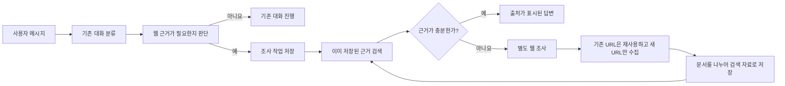

# 웹 근거 조사 기능 실행 계획

- 프로젝트: Think Chair
- 작성일: 2026-07-29
- 상태: 주요 방향 결정 완료. 검색 서비스와 저장 기술, 자료 보존 기간, 품질·비용 기준은 해당 작업을 시작하기 전에 확정
- 목표: 웹 근거가 필요한 메시지를 알아내고, 별도 조사 작업이 믿을 만한 자료를 찾아 저장한 뒤 출처가 표시된 근거로 대화를 보강한다.
- 세로 MVP 진행·남은 일: [10-vertical-mvp-handoff.md](10-vertical-mvp-handoff.md) (브랜치에 PR 03~06 상당이 한 줄로 묶인 상태)
- Judge 정량 문제집(**서비스 성장·절대 점수**): [11-rag-judge-corpus-plan.md](11-rag-judge-corpus-plan.md)

## 전체 흐름

`research_required`는 사용자가 무엇을 원하는지 분류하는 값이 아니라, 현재 메시지에 웹 조사가 추가로 필요한지를 나타내는 값이다. 참이면 별도 조사 작업을 만든다.

각 조사 작업(`ResearchJob`)은 고유한 `research_job_id`로 진행 상태를 기록한다. 기존 채팅의 진행 상태와 섞이지 않도록 별도로 관리한다.

## 세부 작업

| 순서 | 문서 | 결과 | 먼저 필요한 작업 | 현재 서비스 변경 |
|---|---|---|---|---|
| 1 | [검색·원문 수집](01-search-fetch.md) | `search_web`, `fetch_page` | 없음 | 없음 |
| 2 | [문서 분할·검색용 저장](02-indexing.md) | 공용 웹 자료와 사용자별 비공개 자료 저장소 | 작업 1 | 없음 |
| 3 | [근거 검색·응답](03-retrieval-response.md) | 검증된 인용 응답 | 작업 2 | 없음 |
| 4 | [독립 조사 실행](04-research-subgraph.md) | 메인 채팅과 분리된 조사 실행기 | 작업 1~3 | 없음 |
| 5 | [조사 필요 여부 판단·작업 생성](05-detection-dispatch.md) | `ResearchJob` 생성 | 필요 여부 판단은 독립, 작업 생성은 작업 4 | 없음 |
| 6 | [메인 채팅과 결과 연결](06-async-integration.md) | 사용자에게 조사 결과 전달 | 작업 3~5 | 있음 |

작업 1~5는 기존 채팅에 연결하지 않고 따로 검증한다. 작업 6에서만 실제 사용자 대화에 연결한다.

## PR 실행 단위

구현과 검토가 지나치게 커지지 않도록 [PR 실행 계획](prs/README.md)에서 총 7개 PR로 나눈다. 검색과 원문 수집처럼 함께 동작하는 기능은 한 PR에서 검증하고, 자료 저장이나 실제 채팅 연결처럼 따로 되돌릴 이유가 있는 경계는 분리한다.

## 현재 구조에서 지켜야 할 경계

| 확인된 사실 | 설계 영향 |
|---|---|
| 채팅 그래프는 `app/main.py`에서 한 번 준비된다. | 조사 그래프도 앱 시작 지점에서 별도로 한 번 준비한다. |
| `UserAction`은 서로 겹치지 않는 사용자 요청 종류다. | 웹 조사 필요 여부인 `research_required`를 `UserAction`에 섞지 않는다. |
| `BackgroundTaskRegistry`는 실행 예약만 담당하며, 재시작 후 상태를 복구하지 않는다. | 조사 상태는 DB에 따로 저장한다. |
| 현재 검색·임베딩·벡터 저장소를 직접 사용하는 코드가 없다. | 실제 기술을 선택하기 전에 교체용 구조부터 만들지 않는다. |

## 구현 전에 정할 사항

세부 계약과 조사 근거는 [사전 결정 사항](00-preimplementation-decisions.md)에서 관리한다.

낯선 용어는 다음 뜻으로 사용한다.

- `corpus`: 검색에 사용할 수 있도록 저장한 자료 모음
- `임베딩`: 문장의 의미가 비슷한지 계산할 수 있도록 숫자로 바꾸는 방식
- `벡터 저장소`: 임베딩된 자료를 보관하고 비슷한 내용을 찾는 저장소

| 결정 | 내용 | 상태 | 결정 시점 |
|---|---|---|---|
| D1 | 사용할 검색·원문 수집 서비스와 호출 제한 | `OPEN` | PR 01 전 |
| D2 | 한국어·영어를 함께 검색할 임베딩 모델과 벡터 저장소 | `OPEN` | PR 02 전 |
| D3 | 공용·비공개 자료의 소유권과 보존 기간 | `PARTIAL` | PR 02 전 |
| D4 | 조사 결과를 사용자에게 전달하는 방법 | `DECIDED` | PR 06 반영 |
| D5 | 근거가 충분한지와 웹 검색을 시작할 기준 | `DECIDED` | PR 03 반영 |
| D6 | 중복 실행·재시작·복구 | `DECIDED` | PR 05 반영 |
| D7 | 평가 자료와 관측 | `PARTIAL` | 게이트 폐기. 문제집=서비스 성장(절대 점수) → `11` |
| D8 | 운영 기록·개인정보·비용 | `PARTIAL` | D1과 실제 조사 실행 측정 후 수치 확정 |
| D9 | 보안·공용 자료 등록·삭제 | `DECIDED` | PR 01/06 반영 |

## 출처 정책

- 검색 순위를 신뢰도 점수로 취급하지 않는다.
- 공식 문서, 표준, 원 논문, 원본 벤치마크를 우선한다.
- 원 주장과 수치는 가능한 한 1차 출처에 연결한다.
- 논쟁적 주장은 독립된 출처와 상반된 결과를 함께 보존한다.
- 발행 주체, 원문 URL, 발행일, 수집일을 저장한다.
- 출처가 말한 범위와 조건을 응답에 함께 제시한다.

## 구현·배포 순서

1. PR 00에서 공용 평가 계약, 실제 공개 자료 기반 corpus, judge 입출력 schema와 게이트를 고정하고 미구현 검증을 의도된 실패로 표시
2. PR 01에서 웹 검색과 안전한 원문 수집 도구를 함께 검증
3. PR 02에서 수집 자료를 나누고 임베딩해 저장
4. PR 03에서 저장된 근거를 찾고 실제 자료만 인용하며 baseline/RAG 비교와 사전 정의된 평가 게이트를 통과하고 관련 `xfail`을 성공으로 전환
5. PR 04에서 조사 필요 여부를 실제 대화 기록으로 측정하고 관련 `xfail`을 성공으로 전환하되 사용자 기능에는 반영하지 않음
6. PR 05에서 조사 작업 저장·예약과 독립 실행을 함께 검증
7. PR 06에서 주기적인 상태 확인 방식으로 실제 채팅에 연결
8. 문제가 생기면 채팅과 조사 기능의 연결만 제거하여 기존 대화 방식으로 복구

## 공통 검증

- 각 작업 문서의 완료 조건 통과
- 기존 `tests/unit/chat/test_chat_service.py` 회귀 통과
- 기존 `tests/e2e/test_chat_flow.py` 회귀 통과
- `uv run ruff check app tests`
- `git diff --check`

## 제외 범위

아래 항목은 불필요하다는 뜻이 아니라, 현재 단계의 완료 조건에서 제외한다는 뜻이다.

| 항목 | 무엇을 포함하는가 | 현재 제외하는 이유 | 재검토 조건 |
|---|---|---|---|
| PDF와 JavaScript 실행이 필요한 페이지 수집 | PDF 본문·표 추출, 문자 인식, 브라우저에서 실행한 뒤 보이는 내용 수집 | 일반 HTML 수집과 다른 도구·실행 환경·보안 검사가 필요하다. | 필요한 1차 출처를 일반 HTML 수집만으로 확보할 수 없을 때 |
| 여러 서비스의 교체 구조 | 검색·임베딩·벡터 저장소를 여러 업체 제품으로 교체하거나 분산하는 구조 | 같은 역할의 구현이 하나뿐인 상태에서는 불필요한 구조다. | 두 번째 서비스를 실제로 운영하거나 장애 대비·비용 분산이 필요할 때 |
| 브라우저 자동화 | 별도 브라우저로 페이지 실행, 클릭, 스크롤, 로그인 상태 처리 | 단순 원문 수집보다 자원·보안·운영 비용이 크다. | 핵심 출처를 일반 HTTP 요청으로 반복해서 확보하지 못할 때 |
| 지식 그래프 | 문서 속 대상과 관계를 뽑아 여러 자료를 연결하는 검색 | 초기 목표인 출처 검색과 인용은 벡터 검색으로 먼저 검증할 수 있다. | 여러 문서를 이어서 판단하는 검색이 실제 병목으로 확인될 때 |
| 외부 작업 대기열 | Celery, RQ, SQS 같은 별도 작업 처리 시스템과 자동 재시도 | 첫 단계는 DB에 조사 상태를 저장하고 현재 백그라운드 실행 기능을 재사용할 수 있다. | 여러 서버에서 실행하거나 재시작 후 자동 복구, 처리 시간 보장이 필요할 때 |
| 기존 URL 재수집과 과거 원문 보존 | 저장된 URL의 변경 확인, 원문 갱신, 과거 원문·문서 조각·벡터 보관 | 기술 문서와 벤치마크 자료의 변경 이력을 제품 기능으로 제공하지 않으며 수집·검토·보존 비용이 더 크다. | 같은 URL의 최신 내용 반영이나 과거 답변의 정확한 재현, 감사·법적 보존이 필요할 때 |
| 선택하지 않은 실시간 UI | 서버가 먼저 보내는 알림, 자동 후속 답변, 현재 답변 수정, 상세 진행률 | 첫 버전은 주기적 상태 확인과 `근거 준비됨` 표시만 사용하기로 정했다. | 실제 사용에서 완료 사실을 늦게 알게 되는 문제가 측정될 때 |
