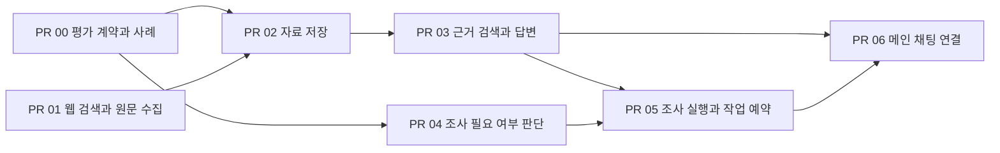

# PR 실행 계획

[전체 계획](../README.md) · [사전 결정 사항](../00-preimplementation-decisions.md)

구현은 PR 00을 포함해 총 7개 PR로 나눈다. 각 PR은 하나의 기능 흐름을
끝까지 검증할 수 있어야 하며, 따로 되돌릴 이유가 있는 경계만 분리한다.
단, PR 00은 후속 기능의 평가 계약만 고정하고 아직 구현되지 않은 검증은 담당
PR이 적힌 `strict xfail`로 남긴다.
마지막 PR 전까지 기존 사용자 대화는 변경하지 않는다.

## 의존 관계

공용 평가 사례·실제 공개 자료 corpus·계약을 고정한 뒤에는 웹 자료 저장·검색과
조사 필요 여부 판단을 개발할 수 있다. PR 03은 baseline/RAG 평가 게이트를
통과해야 하며, 게이트를 충족하지 못하면 PR 04~06으로 진행하지 않는다. PR 03과
PR 04는 자신이 맡은 `xfail`을 실제 구현 결과로 교체해야 한다. 메인 채팅 연결은
근거 답변과 조사 작업 실행이 모두 끝난 뒤 시작한다.

## PR 목록

| PR | 변경 단위 | 선행 조건 | 현재 서비스 변경 |
|---|---|---|---|
| [00](00-evaluation-harness.md) | 공용 평가 계약·공개 자료 corpus와 의도된 실패 | 없음 | 없음 |
| [01](01-search-fetch.md) | 웹 검색과 안전한 HTML 원문 수집 | D1, D9 | 없음 |
| [02](02-indexing.md) | 웹 자료 분할·임베딩·저장 | PR 00~01, D2, D3, D7, D9 | 없음 |
| [03](03-retrieval-response.md) | 근거 검색·출처 답변·baseline/RAG 평가 게이트 | PR 02, D5, D7, D9 | 없음 |
| [04](04-evidence-detector.md) | 웹 조사가 필요한 메시지를 찾고 정확도 측정 | PR 00, D7, D8 | 없음 |
| [05](05-research-runner.md) | 독립 조사 실행과 중복 없는 작업 예약 | PR 03~04, D5, D6, D8, D9 | 없음 |
| [06](06-async-integration.md) | 메인 채팅과 조사 결과 연결 | PR 03, PR 05, D4~D9 | 있음 |

## 모든 PR의 완료 조건

- 해당 PR 문서의 완료 조건 충족
- 새로 공개되는 함수·API의 입력과 출력에 최소 단위 테스트 존재
- `xfail`은 담당 후속 PR과 성공 전환 조건이 명시된 경우에만 허용
- 담당 PR은 자신에게 배정된 `xfail`을 실제 구현 기반 테스트로 교체
- 웹 조사가 필요하지 않은 기존 대화가 그대로 동작
- `uv run ruff check app tests`
- 관련 테스트와 `git diff --check` 통과
